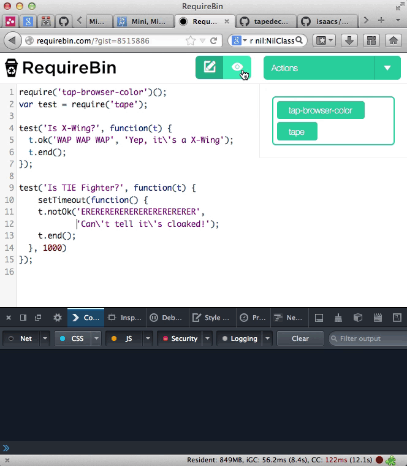

tap-browser-color
=================

A super simple tap/tape reporter that changes the body tag background color depending on if the tests are passing, failing, or pending.

[Live example](http://requirebin.com/?gist=8515886)!



This is meant for live-coding or environments where you want a big swath of color when your test status changes.

Usage
=====

Best used with [requirebin](http://requirebin.com/).

```js
// Executing immediately intercepts (and still passes) console.log output
var undo = require('tap-browser-color')();
var tape = require('tape');

test('yep', function(t) {
  t.ok('whatup');
  t.end();
});

// Entirely optional, this just removes the `console.log` intercept.
// Probably pretty useless.
undo();
```

License
=======

MIT
